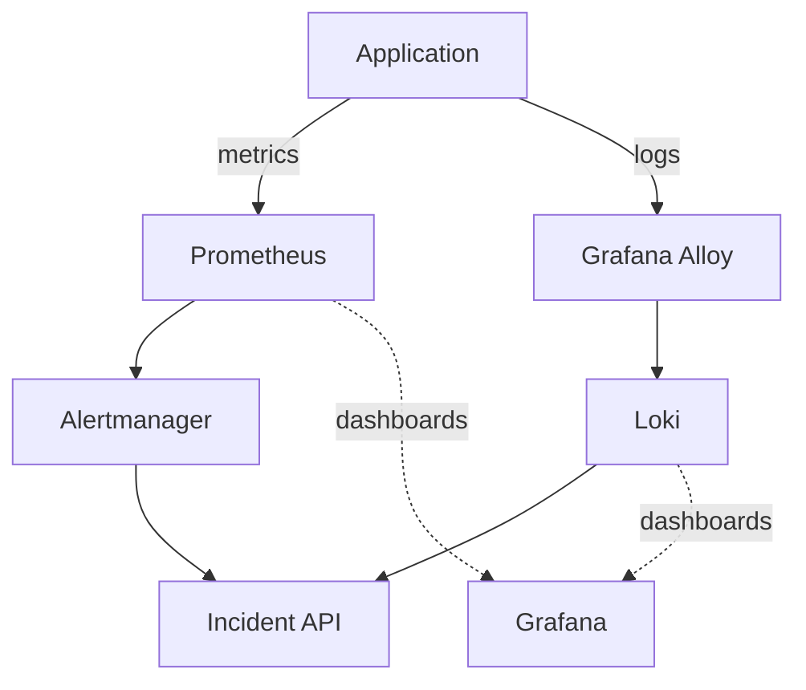
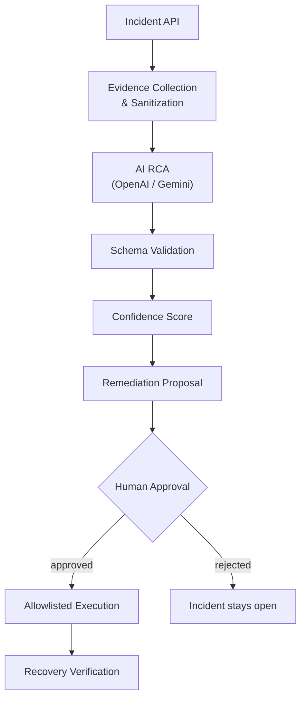
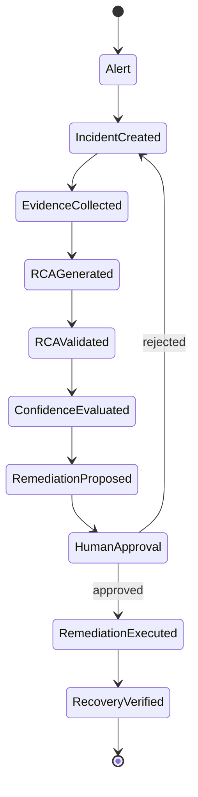
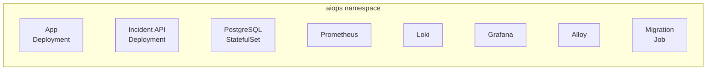
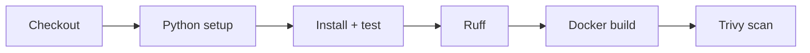
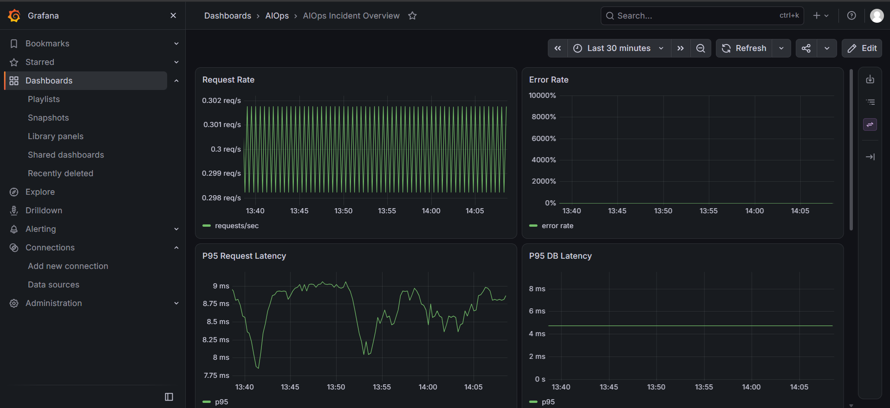
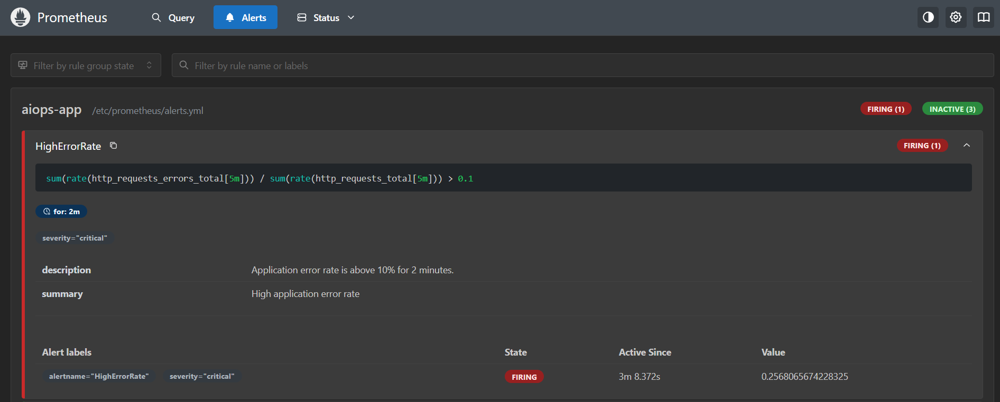
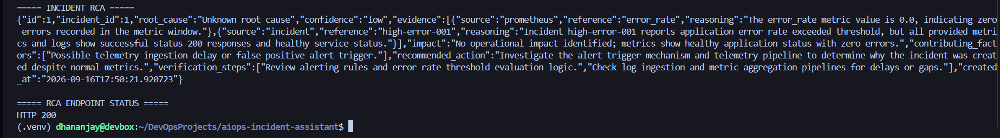
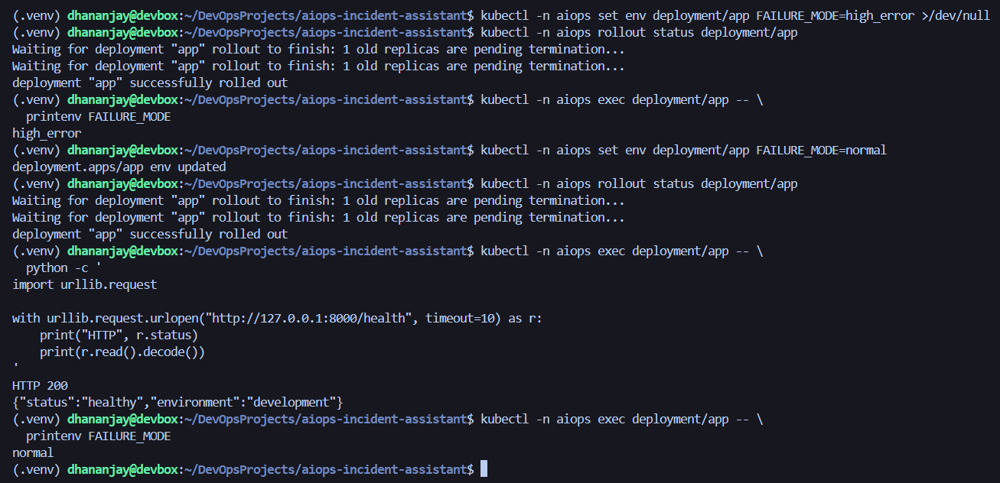

# AIOps Incident Assistant

An evidence-driven incident response platform. It detects incidents from observability signals, collects and correlates evidence, generates an AI-assisted root cause analysis, and remediates only after human approval — with recovery verified afterward, not assumed.

## Overview

Manual incident response means an engineer cross-referencing alerts, metrics, logs, application state, and deployment history by hand. This platform automates that correlation without removing the human from the decision:

Alert → Incident → Evidence Collection → AI RCA → Validation → Confidence Score → Remediation Proposal → Human Approval → Controlled Execution → Recovery Verification

When the evidence doesn't support a confident conclusion, the RCA engine returns an explicit **unknown root cause** instead of fabricating one.

## Architecture

**Observability ingestion** — metrics and logs leave the app on separate paths and converge as an alert at the Incident API.


**Incident processing** — from alert to verified recovery.



The RCA engine takes structured evidence — error rates, latency, logs, incident context — rather than the raw alert alone, and supports **OpenAI** or **Gemini** as interchangeable providers behind the same validated schema.

## Incident Lifecycle



Detection, diagnosis, decision, execution, and verification are separate, auditable states — not one AI call.

## Key Capabilities

- Health/readiness monitoring, Prometheus metrics, Loki logs, Grafana dashboards
- Alert-driven incident lifecycle with explicit state transitions
- Evidence collection, correlation, and sanitization before it reaches the model
- AI RCA via OpenAI or Gemini, with schema validation and confidence scoring
- Remediation gated behind an allowlist and human approval, with dry-run support
- Recovery verification after every executed remediation
- Controlled failure injection for testing the full incident path
- Kubernetes deployment with pod-level security controls
- CI: tests, linting, Docker build, Trivy vulnerability scan

## Technology Stack

| Area                 | Technology                     |
|----------------------|---------------------------------|
| Application          | Python, FastAPI                 |
| Database             | PostgreSQL + Alembic migrations |
| Metrics              | Prometheus                      |
| Logging              | Loki, Grafana Alloy             |
| Visualization        | Grafana                         |
| AI                   | OpenAI API, Google Gemini API   |
| Containers           | Docker                          |
| Orchestration        | Kubernetes (Kind for local)     |
| Testing              | Pytest                          |
| Linting              | Ruff                            |
| Security scanning    | Trivy                           |
| CI/CD                | GitHub Actions                  |


## API Surface

| Endpoint | Purpose |
|---|---|
| `POST /incidents` | Create an incident from an alert |
| `POST /incidents/{id}/transition` | Move an incident through its lifecycle |
| `GET /incidents/{id}/evidence` | Return collected evidence |
| `POST /incidents/{id}/rca` | Run the configured RCA provider and persist the result |
| `GET /incidents/{id}/rca` | Return the latest persisted RCA |

## Failure Engineering

Failure injection is built in, not bolted on — every scenario below is exercised through the full detection-to-recovery path:

- **High error rate** → alert → incident → evidence → RCA → recovery
- **High latency** → alert → incident → investigation → recovery
- **Database failure** → app errors → health signal → alert → incident → recovery

## Kubernetes Deployment

Runs locally on Kind, no cloud dependency required.



Workloads run non-root (UID 1000), with privilege escalation disabled, capabilities dropped, unnecessary service-account tokens disabled, and CPU/memory limits enforced — all covered by dedicated Kubernetes security tests.

## Security

- **Container:** non-root user, no privilege escalation, dropped capabilities, secrets excluded from the build context
- **Kubernetes:** `runAsNonRoot`, explicit UID, disabled privilege escalation, disabled unnecessary service-account tokens
- **Secrets:** PostgreSQL and AI provider credentials via Kubernetes Secrets, never hardcoded; `.env` is git-ignored, `.env.example` documents required config
- **Image scanning:** Trivy runs in CI and fails the build on HIGH/CRITICAL findings with a known fix — currently 0 HIGH/CRITICAL, 0 secrets detected

## Running Locally

```bash
cp .env.example .env      # fill in required values
docker compose up --build
```

## Running on Kind

```bash
# apply manifests from k8s/, then:
kubectl -n aiops get pods
```

Expected pods: `app`, `incident-api`, `postgres`, `prometheus`, `loki`, `alloy`, `grafana`.

## Testing & CI

```bash
pytest -q          # 121 passed
ruff check .        # all checks passed
```



## Engineering Principles

- **Evidence over guessing** — the RCA engine reasons from structured evidence, not the bare alert.
- **Unknown is a valid answer** — insufficient evidence returns "unknown," not a fabricated cause.
- **Logs are data, not instructions** — observability input is sanitized before it reaches the model.
- **Human in the loop** — AI recommends; execution needs approval.
- **Recovery is verified, not assumed** — an action isn't "done" until the system is confirmed healthy again.

## Screenshots

| | |
|---|---|
|  |  |
| Grafana dashboard | Alert firing |
|  |  |
| Incident RCA | Remediation & recovery |
